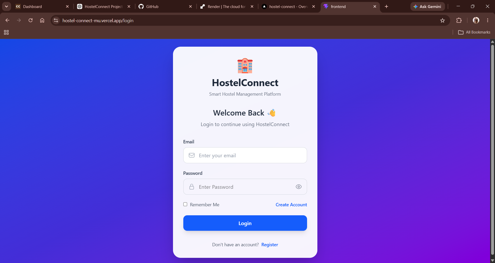
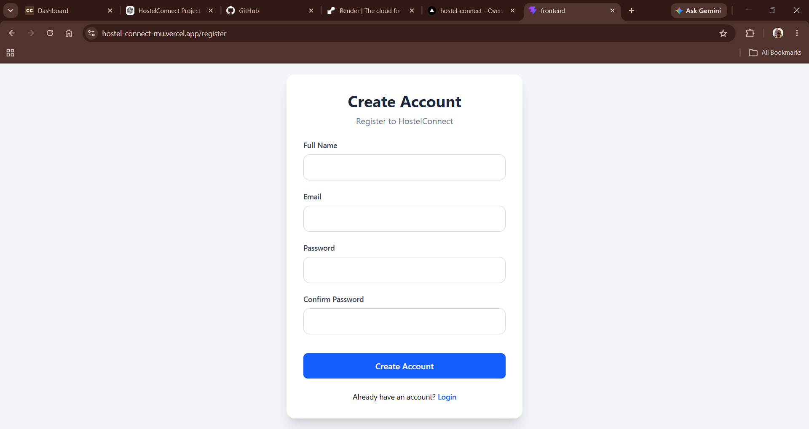
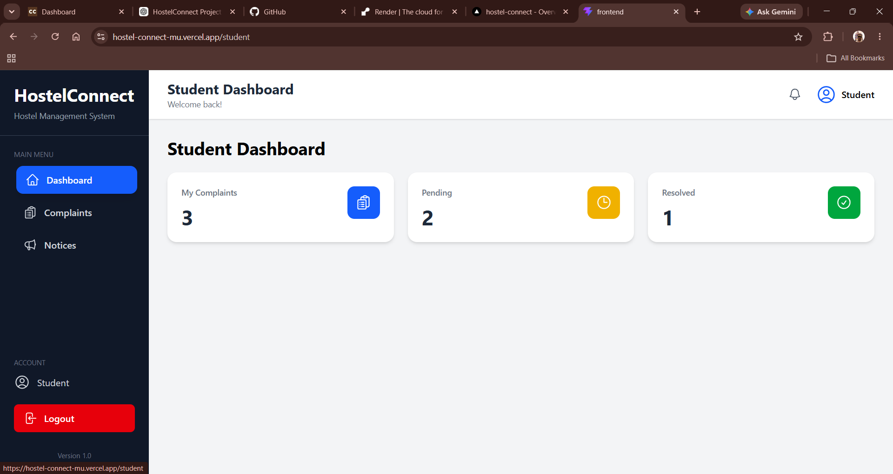
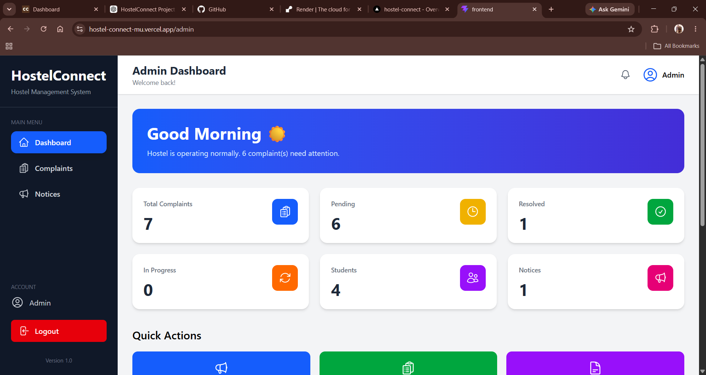
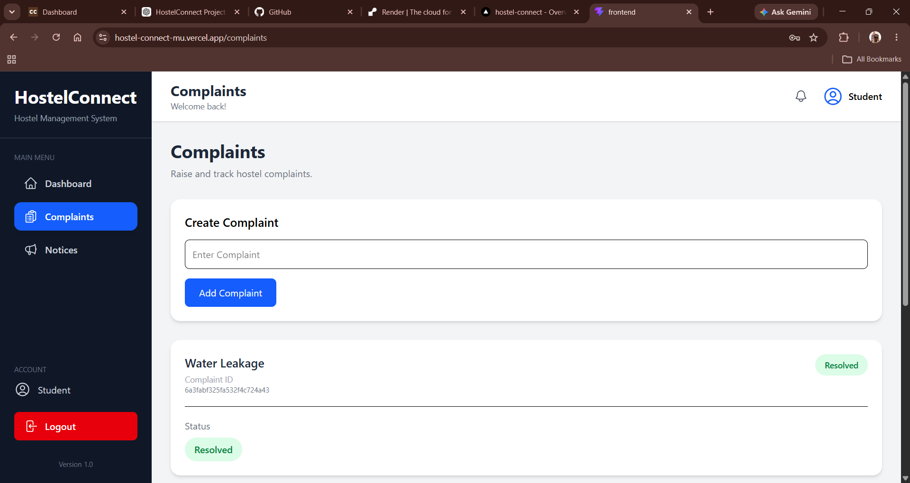
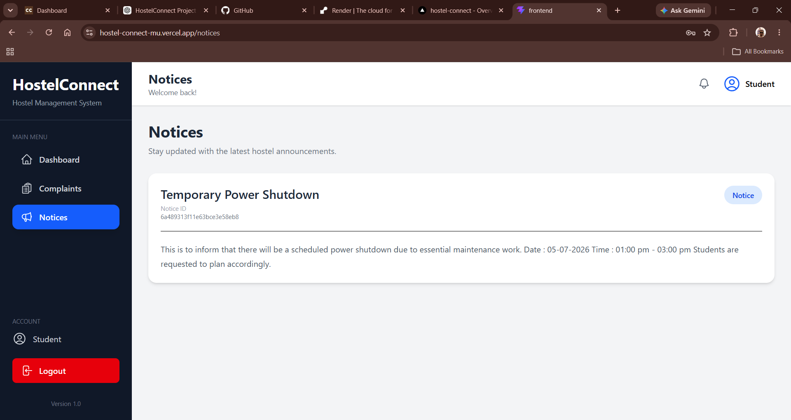

# 🏠 HostelConnect

> 🚀 **Status:** Production Ready | Live Demo Available

A full-stack **MERN Hostel Management System** that simplifies hostel operations through complaint management, notice management, and secure role-based authentication for students and administrators.


---

# 🚀 Live Demo

- 🌐 **Frontend:** https://hostel-connect-mu.vercel.app/
- ⚙️ **Backend API:** https://hostelconnect-api-uwae.onrender.com/
- 📂 **GitHub Repository:** https://github.com/arpit571/HostelConnect

---

# 📖 About the Project

HostelConnect is a full-stack hostel management platform built using the **MERN Stack** to digitize hostel operations and improve communication between students and hostel administrators.

The platform allows students to raise complaints, track their complaint status, and view hostel notices, while administrators can efficiently manage complaints and publish important announcements through dedicated dashboards.

The project demonstrates practical full-stack development skills including REST API development, JWT authentication, MongoDB integration, responsive frontend development, and cloud deployment.

---

# ✨ Features

## 👨‍🎓 Student

- User Registration & Login
- Secure JWT Authentication
- Student Dashboard
- Raise Hostel Complaints
- Track Complaint Status
- View Hostel Notices
- Responsive Dashboard

## 👨‍💼 Administrator

- Admin Dashboard
- View All Complaints
- Update Complaint Status
- Create & Manage Notices
- Dashboard Statistics

## 🔒 Security

- JWT Authentication
- Password Hashing using bcryptjs
- Protected Routes
- Role-Based Authorization

---

# 🛠️ Tech Stack

### Frontend

- React
- Vite
- Tailwind CSS
- Axios
- React Router

### Backend

- Node.js
- Express.js

### Database

- MongoDB Atlas
- Mongoose

### Authentication

- JWT
- bcryptjs

### Deployment

- Vercel (Frontend)
- Render (Backend)

---

# 📸 Screenshots

## Login



## Register



## Student Dashboard



## Admin Dashboard



## Complaints



## Notice Board



---

# 📁 Project Structure

```text
HostelConnect
│
├── backend
│   ├── config
│   ├── controllers
│   ├── middleware
│   ├── models
│   ├── routes
│   └── server.js
│
├── frontend
│   ├── src
│   ├── public
│   └── package.json
│
├── screenshots
├── README.md
├── LICENSE
├── .env.example
└── .gitignore
```

---

# ⚙️ Installation

### 1. Clone the Repository

```bash
git clone https://github.com/arpit571/HostelConnect.git
```

### 2. Install Dependencies

Backend

```bash
cd backend
npm install
```

Frontend

```bash
cd ../frontend
npm install
```

### 3. Configure Environment Variables

Copy the example environment file and create your own `.env` file.

```bash
cp .env.example .env
```

Update the values according to your local environment.

### 4. Run the Project

Backend

```bash
cd backend
npm run dev
```

Frontend

```bash
cd frontend
npm run dev
```

---

# 🔑 Environment Variables

The project includes a `.env.example` file.

Configure the following variables before running the project.

### Backend

- `PORT`
- `MONGO_URI`
- `JWT_SECRET`

### Frontend

- `VITE_API_URL`

---

# 🚀 Future Improvements

- Email Notifications
- File Attachments for Complaints
- Search & Filtering
- Dashboard Analytics

---

# 👨‍💻 Author

**Arpit Upadhyay**

GitHub: https://github.com/arpit571

If you have any suggestions or feedback, feel free to open an issue or connect with me.

---

# 📄 License

This project is licensed under the MIT License.
